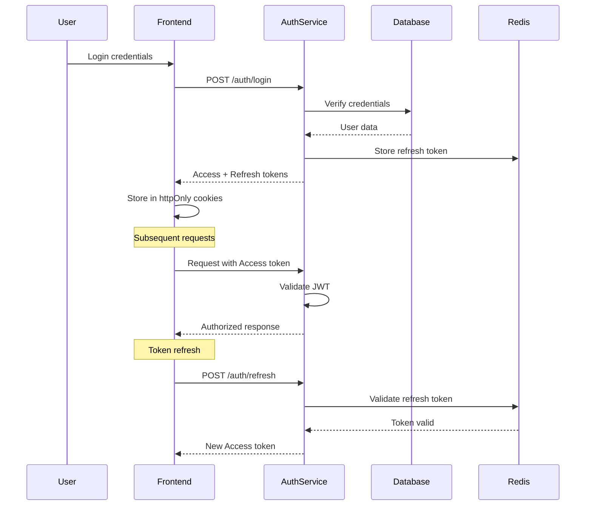

# Security Architecture

## Overview

The security architecture implements defense in depth with multiple layers of protection, from network security to application-level controls, ensuring data protection and regulatory compliance.

## Security Layers

```yaml
Security Layers:
  1. Network:
     - Azure Web Application Firewall (WAF)
     - DDoS protection
     - Private endpoints for databases
     - Network segmentation
  
  2. Application:
     - JWT with short expiry (15min access, 30day refresh)
     - Rate limiting per user/IP
     - Input sanitization
     - CORS configuration
     - CSP headers
  
  3. Data:
     - Encryption at rest (AES-256)
     - Encryption in transit (TLS 1.3)
     - Column-level encryption for PII
     - Key rotation every 90 days
  
  4. Access Control:
     - RBAC implementation
     - Principle of least privilege
     - Service-to-service auth (mTLS)
     - API key management
```

## Authentication Architecture

### JWT Token Strategy

```typescript
// Token configuration
const tokenConfig = {
  access: {
    secret: process.env.JWT_ACCESS_SECRET,
    expiresIn: '15m',
    algorithm: 'RS256',
    issuer: 'afl-platform',
    audience: 'afl-api'
  },
  refresh: {
    secret: process.env.JWT_REFRESH_SECRET,
    expiresIn: '30d',
    algorithm: 'RS256',
    issuer: 'afl-platform',
    audience: 'afl-api'
  }
};

// Token payload structure
interface AccessTokenPayload {
  sub: string;           // User ID
  email: string;
  roles: string[];
  permissions: string[];
  sessionId: string;
  iat: number;
  exp: number;
  iss: string;
  aud: string;
}

interface RefreshTokenPayload {
  sub: string;
  sessionId: string;
  tokenFamily: string;   // For refresh token rotation
  iat: number;
  exp: number;
}
```

### Authentication Flow



### Password Security

```typescript
// Password hashing configuration
import bcrypt from 'bcrypt';
import { z } from 'zod';

const SALT_ROUNDS = 12;

// Password validation schema
const passwordSchema = z.string()
  .min(8, 'Password must be at least 8 characters')
  .regex(/[A-Z]/, 'Password must contain uppercase letter')
  .regex(/[a-z]/, 'Password must contain lowercase letter')
  .regex(/[0-9]/, 'Password must contain number')
  .regex(/[^A-Za-z0-9]/, 'Password must contain special character');

// Password hashing
export async function hashPassword(password: string): Promise<string> {
  // Validate password strength
  passwordSchema.parse(password);
  
  // Hash with bcrypt
  return bcrypt.hash(password, SALT_ROUNDS);
}

// Password verification
export async function verifyPassword(
  password: string,
  hash: string
): Promise<boolean> {
  return bcrypt.compare(password, hash);
}

// Password reset token
export function generateResetToken(): string {
  return crypto.randomBytes(32).toString('hex');
}
```

## Authorization

### Role-Based Access Control (RBAC)

```typescript
// Role definitions
enum Role {
  USER = 'user',
  PREMIUM = 'premium',
  MODERATOR = 'moderator',
  ADMIN = 'admin'
}

// Permission definitions
enum Permission {
  // Formula permissions
  FORMULA_CREATE = 'formula:create',
  FORMULA_READ = 'formula:read',
  FORMULA_UPDATE = 'formula:update',
  FORMULA_DELETE = 'formula:delete',
  FORMULA_PUBLISH = 'formula:publish',
  
  // Prediction permissions
  PREDICTION_CREATE = 'prediction:create',
  PREDICTION_READ = 'prediction:read',
  PREDICTION_UNLIMITED = 'prediction:unlimited',
  
  // Backtest permissions
  BACKTEST_RUN = 'backtest:run',
  BACKTEST_UNLIMITED = 'backtest:unlimited',
  
  // Admin permissions
  USER_MANAGE = 'user:manage',
  SYSTEM_ADMIN = 'system:admin'
}

// Role-Permission mapping
const rolePermissions: Record<Role, Permission[]> = {
  [Role.USER]: [
    Permission.FORMULA_CREATE,
    Permission.FORMULA_READ,
    Permission.FORMULA_UPDATE,
    Permission.FORMULA_DELETE,
    Permission.PREDICTION_CREATE,
    Permission.PREDICTION_READ,
    Permission.BACKTEST_RUN
  ],
  [Role.PREMIUM]: [
    ...rolePermissions[Role.USER],
    Permission.PREDICTION_UNLIMITED,
    Permission.BACKTEST_UNLIMITED,
    Permission.FORMULA_PUBLISH
  ],
  [Role.MODERATOR]: [
    ...rolePermissions[Role.PREMIUM],
    Permission.USER_MANAGE
  ],
  [Role.ADMIN]: [
    ...rolePermissions[Role.MODERATOR],
    Permission.SYSTEM_ADMIN
  ]
};

// Authorization middleware
export const authorize = (...permissions: Permission[]) => {
  return async (req: Request, res: Response, next: NextFunction) => {
    const user = req.user;
    
    if (!user) {
      return res.status(401).json({ error: 'Unauthorized' });
    }
    
    const userPermissions = rolePermissions[user.role as Role] || [];
    const hasPermission = permissions.every(p => 
      userPermissions.includes(p)
    );
    
    if (!hasPermission) {
      return res.status(403).json({ error: 'Forbidden' });
    }
    
    next();
  };
};
```

## API Security

### Rate Limiting

```typescript
// Rate limiting configuration
const rateLimitConfig = {
  global: {
    windowMs: 60 * 1000,     // 1 minute
    max: 100,                 // requests
    message: 'Too many requests'
  },
  auth: {
    windowMs: 15 * 60 * 1000, // 15 minutes
    max: 5,                    // attempts
    skipSuccessfulRequests: true
  },
  api: {
    user: {
      windowMs: 60 * 1000,
      max: 60
    },
    premium: {
      windowMs: 60 * 1000,
      max: 200
    }
  },
  sensitive: {
    windowMs: 60 * 60 * 1000, // 1 hour
    max: 10
  }
};

// Dynamic rate limiting based on user tier
export const dynamicRateLimiter = () => {
  return async (req: Request, res: Response, next: NextFunction) => {
    const tier = req.user?.role || 'anonymous';
    const config = rateLimitConfig.api[tier] || rateLimitConfig.global;
    
    const limiter = rateLimit({
      ...config,
      keyGenerator: (req) => req.user?.id || req.ip,
      handler: (req, res) => {
        res.status(429).json({
          error: 'Rate limit exceeded',
          retryAfter: res.getHeader('Retry-After')
        });
      }
    });
    
    limiter(req, res, next);
  };
};
```

### Input Validation and Sanitization

```typescript
import { z } from 'zod';
import DOMPurify from 'isomorphic-dompurify';

// Input validation schemas
const schemas = {
  formula: z.object({
    name: z.string().min(1).max(100),
    description: z.string().max(500).optional(),
    metrics: z.array(z.object({
      id: z.string().uuid(),
      weight: z.number().min(0).max(100)
    })).max(10)
  }),
  
  prediction: z.object({
    formulaId: z.string().uuid(),
    matchId: z.string().uuid()
  })
};

// Sanitization middleware
export const sanitizeInput = (req: Request, res: Response, next: NextFunction) => {
  // Sanitize string inputs
  const sanitizeStrings = (obj: any): any => {
    if (typeof obj === 'string') {
      return DOMPurify.sanitize(obj, { ALLOWED_TAGS: [] });
    }
    if (typeof obj === 'object' && obj !== null) {
      return Object.keys(obj).reduce((acc, key) => ({
        ...acc,
        [key]: sanitizeStrings(obj[key])
      }), Array.isArray(obj) ? [] : {});
    }
    return obj;
  };
  
  req.body = sanitizeStrings(req.body);
  req.query = sanitizeStrings(req.query);
  req.params = sanitizeStrings(req.params);
  
  next();
};

// SQL injection prevention
export const preventSQLInjection = (value: string): string => {
  // Remove SQL keywords and special characters
  const sqlKeywords = /(\b(SELECT|INSERT|UPDATE|DELETE|DROP|UNION|WHERE|FROM)\b)/gi;
  const specialChars = /[;'"\\]/g;
  
  return value
    .replace(sqlKeywords, '')
    .replace(specialChars, '');
};
```

### CORS Configuration

```typescript
import cors from 'cors';

const corsOptions: cors.CorsOptions = {
  origin: (origin, callback) => {
    const allowedOrigins = [
      process.env.FRONTEND_URL,
      'https://afl-predictor.com',
      'https://www.afl-predictor.com'
    ];
    
    // Allow requests with no origin (mobile apps, Postman)
    if (!origin || allowedOrigins.includes(origin)) {
      callback(null, true);
    } else {
      callback(new Error('Not allowed by CORS'));
    }
  },
  credentials: true,
  methods: ['GET', 'POST', 'PUT', 'DELETE', 'OPTIONS'],
  allowedHeaders: ['Content-Type', 'Authorization', 'X-Request-ID'],
  exposedHeaders: ['X-Total-Count', 'X-Page-Count'],
  maxAge: 86400 // 24 hours
};

app.use(cors(corsOptions));
```

## Security Headers

```typescript
import helmet from 'helmet';

app.use(helmet({
  contentSecurityPolicy: {
    directives: {
      defaultSrc: ["'self'"],
      scriptSrc: ["'self'", "'unsafe-inline'", 'https://cdn.jsdelivr.net'],
      styleSrc: ["'self'", "'unsafe-inline'", 'https://fonts.googleapis.com'],
      fontSrc: ["'self'", 'https://fonts.gstatic.com'],
      imgSrc: ["'self'", 'data:', 'https:'],
      connectSrc: ["'self'", process.env.API_URL],
      frameSrc: ["'none'"],
      objectSrc: ["'none'"],
      upgradeInsecureRequests: []
    }
  },
  hsts: {
    maxAge: 31536000,
    includeSubDomains: true,
    preload: true
  }
}));

// Additional security headers
app.use((req, res, next) => {
  res.setHeader('X-Frame-Options', 'DENY');
  res.setHeader('X-Content-Type-Options', 'nosniff');
  res.setHeader('Referrer-Policy', 'strict-origin-when-cross-origin');
  res.setHeader('Permissions-Policy', 'geolocation=(), microphone=(), camera=()');
  next();
});
```

## Data Encryption

### Encryption at Rest

```typescript
import crypto from 'crypto';

class EncryptionService {
  private algorithm = 'aes-256-gcm';
  private key: Buffer;
  
  constructor() {
    this.key = Buffer.from(process.env.ENCRYPTION_KEY!, 'hex');
  }
  
  encrypt(text: string): EncryptedData {
    const iv = crypto.randomBytes(16);
    const cipher = crypto.createCipheriv(this.algorithm, this.key, iv);
    
    let encrypted = cipher.update(text, 'utf8', 'hex');
    encrypted += cipher.final('hex');
    
    const authTag = cipher.getAuthTag();
    
    return {
      encrypted,
      iv: iv.toString('hex'),
      authTag: authTag.toString('hex')
    };
  }
  
  decrypt(data: EncryptedData): string {
    const decipher = crypto.createDecipheriv(
      this.algorithm,
      this.key,
      Buffer.from(data.iv, 'hex')
    );
    
    decipher.setAuthTag(Buffer.from(data.authTag, 'hex'));
    
    let decrypted = decipher.update(data.encrypted, 'hex', 'utf8');
    decrypted += decipher.final('utf8');
    
    return decrypted;
  }
}

// Database field encryption
@Entity()
class User {
  @Column({ type: 'text', transformer: encryptionTransformer })
  email: string;
  
  @Column({ type: 'text', transformer: encryptionTransformer })
  personalInfo: string;
}
```

## Audit Logging

```typescript
interface AuditLog {
  id: string;
  timestamp: Date;
  userId?: string;
  ipAddress: string;
  userAgent: string;
  action: string;
  resource: string;
  result: 'success' | 'failure';
  metadata?: Record<string, any>;
}

class AuditService {
  async log(entry: Omit<AuditLog, 'id' | 'timestamp'>): Promise<void> {
    const log: AuditLog = {
      id: generateId(),
      timestamp: new Date(),
      ...entry
    };
    
    // Store in database
    await this.db.auditLogs.create({ data: log });
    
    // Alert on suspicious activity
    if (this.isSuspicious(log)) {
      await this.alertSecurityTeam(log);
    }
  }
  
  private isSuspicious(log: AuditLog): boolean {
    // Multiple failed login attempts
    // Unusual access patterns
    // Privilege escalation attempts
    // Data exfiltration patterns
    return false; // Implementation details
  }
}

// Audit middleware
export const auditMiddleware = (action: string) => {
  return async (req: Request, res: Response, next: NextFunction) => {
    const startTime = Date.now();
    
    res.on('finish', async () => {
      await auditService.log({
        userId: req.user?.id,
        ipAddress: req.ip,
        userAgent: req.get('user-agent') || '',
        action,
        resource: req.path,
        result: res.statusCode < 400 ? 'success' : 'failure',
        metadata: {
          method: req.method,
          statusCode: res.statusCode,
          duration: Date.now() - startTime
        }
      });
    });
    
    next();
  };
};
```

## Vulnerability Management

### Security Scanning

```yaml
Automated Scanning:
  Dependencies:
    - npm audit (daily)
    - Snyk (continuous)
    - OWASP Dependency Check (weekly)
  
  Code:
    - ESLint security plugin
    - SonarQube analysis
    - GitGuardian (secret scanning)
  
  Infrastructure:
    - Azure Security Center
    - Network vulnerability scans
    - Penetration testing (quarterly)
```

### Incident Response

```yaml
Incident Response Plan:
  Detection:
    - Security monitoring alerts
    - User reports
    - Automated scanning
  
  Classification:
    Critical: Data breach, system compromise
    High: Authentication bypass, XSS/SQLi
    Medium: Information disclosure
    Low: Minor vulnerabilities
  
  Response:
    Critical (0-2 hours):
      - Isolate affected systems
      - Assess impact
      - Begin containment
      - Notify stakeholders
    
    High (0-24 hours):
      - Patch vulnerability
      - Review logs
      - Update WAF rules
    
    Medium (1-7 days):
      - Plan remediation
      - Test fixes
      - Deploy patches
    
    Low (30 days):
      - Include in next release
      - Monitor for exploitation
  
  Recovery:
    - Restore normal operations
    - Verify security controls
    - Document lessons learned
    - Update procedures
```

## Compliance

### GDPR Compliance

```typescript
// Data privacy controls
class PrivacyService {
  // Right to access
  async exportUserData(userId: string): Promise<UserData> {
    const data = await this.collectUserData(userId);
    return this.formatForExport(data);
  }
  
  // Right to erasure
  async deleteUserData(userId: string): Promise<void> {
    await this.db.transaction(async (tx) => {
      // Delete personal data
      await tx.users.delete({ where: { id: userId } });
      await tx.formulas.deleteMany({ where: { userId } });
      await tx.predictions.deleteMany({ where: { userId } });
      
      // Anonymize logs
      await tx.auditLogs.updateMany({
        where: { userId },
        data: { userId: null, metadata: {} }
      });
    });
  }
  
  // Consent management
  async updateConsent(
    userId: string,
    consent: ConsentUpdate
  ): Promise<void> {
    await this.db.userConsent.upsert({
      where: { userId },
      update: consent,
      create: { userId, ...consent }
    });
  }
}
```

---

*Security Architecture Version 1.0 - Created 2025-08-28*