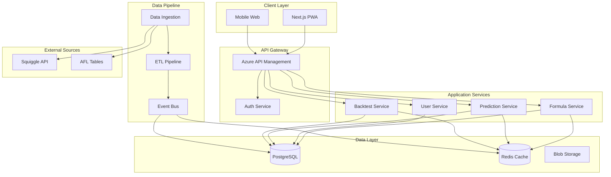

# System Design & Architecture Overview

## Executive Summary

The AFL Data Capture platform uses a microservices architecture with event-driven data pipelines, supporting 10,000+ concurrent users with sub-100ms formula calculations. The system emphasizes user experience, scalability, and real-time data processing.

## System Architecture Diagram



## Architectural Patterns

### 1. Microservices Architecture

Each service has clear boundaries and responsibilities:
- **Autonomous**: Services can be deployed independently
- **Domain-Driven**: Services align with business domains
- **API-First**: All communication through well-defined APIs
- **Database per Service**: Each service owns its data

### 2. Event-Driven Architecture

```yaml
Event Flow:
  Publishers:
    - Data Ingestion Service
    - Formula Service
    - Prediction Service
  
  Event Bus:
    - Technology: Azure Service Bus
    - Pattern: Pub/Sub with Topics
    - Delivery: At-least-once guarantee
  
  Subscribers:
    - Cache Invalidation Service
    - Notification Service
    - Analytics Service
    - Audit Service
```

### 3. CQRS Pattern

**Command Side:**
- Formula creation/updates
- User registration
- Prediction generation

**Query Side:**
- Formula listings
- Prediction history
- Backtest results
- Leaderboards

### 4. API Gateway Pattern

```typescript
// API Gateway responsibilities
const apiGateway = {
  routing: 'Route requests to appropriate services',
  authentication: 'Validate JWT tokens',
  authorization: 'Check user permissions',
  rateLimiting: 'Enforce request limits',
  caching: 'Cache common responses',
  transformation: 'Transform requests/responses',
  aggregation: 'Combine multiple service calls',
  monitoring: 'Track all API calls'
};
```

## Service Architecture

### Service Boundaries

**Formula Service**
- Manages formula CRUD operations
- Validates formula syntax and logic
- Calculates formula weights
- Provides formula templates

**Prediction Service**
- Generates predictions using formulas
- Applies real-time data to calculations
- Manages prediction history
- Calculates confidence scores

**Backtest Service**
- Runs historical simulations
- Calculates accuracy metrics
- Manages backtest cache
- Provides performance analytics

**User Service**
- Handles authentication/authorization
- Manages user profiles
- Tracks user preferences
- Handles account operations

### Service Communication

```typescript
// Inter-service communication patterns
interface CommunicationPatterns {
  synchronous: {
    protocol: 'HTTP/REST',
    useCase: 'Request-response operations',
    timeout: 30000, // 30 seconds
    retry: 3,
    circuitBreaker: true
  },
  
  asynchronous: {
    protocol: 'Message Queue',
    useCase: 'Event notifications, background jobs',
    delivery: 'at-least-once',
    deadLetterQueue: true
  },
  
  streaming: {
    protocol: 'WebSocket',
    useCase: 'Live updates, real-time predictions',
    reconnection: 'automatic',
    heartbeat: 30000
  }
}
```

## Data Pipeline Architecture

```yaml
Pipeline Stages:
  1. Ingestion:
     - Scheduled scraping (AFL Tables)
     - API polling (Squiggle)
     - Rate limiting & retry logic
     - Schema validation
  
  2. Transformation:
     - Data normalization
     - Metric calculations
     - Aggregation operations
     - Quality checks
  
  3. Storage:
     - Hot data → Redis (current season)
     - Warm data → PostgreSQL (2 seasons)
     - Cold data → Blob Storage (archive)
  
  4. Distribution:
     - Event publishing
     - Cache invalidation
     - WebSocket notifications
```

## Scalability Design

### Horizontal Scaling Strategy

```yaml
Scaling Triggers:
  CPU: 
    scale_up: ">70% for 5min"
    scale_down: "<30% for 10min"
  
  Memory:
    scale_up: ">80% for 5min"
    scale_down: "<40% for 10min"
  
  Request Rate:
    scale_up: ">1000 req/s"
    scale_down: "<100 req/s"
  
  Queue Depth:
    scale_up: ">100 messages"
    scale_down: "<10 messages"

Instance Configuration:
  min_instances: 2
  max_instances: 20
  scale_increment: 2
  cooldown_period: 300s
```

### Load Distribution

```nginx
# Load balancing configuration
upstream backend {
    least_conn;
    
    server formula-service-1:3001 weight=3;
    server formula-service-2:3001 weight=3;
    server prediction-service-1:3002 weight=2;
    server prediction-service-2:3002 weight=2;
    server backtest-service:3003 weight=1;
    
    keepalive 32;
}

# Circuit breaker pattern
location /api {
    proxy_pass http://backend;
    proxy_next_upstream error timeout http_503;
    proxy_connect_timeout 1s;
    proxy_read_timeout 30s;
    proxy_intercept_errors on;
    
    # Retry logic
    proxy_next_upstream_tries 3;
    proxy_next_upstream_timeout 10s;
}
```

## Resilience Patterns

### Circuit Breaker

```typescript
class CircuitBreaker {
  private state: 'CLOSED' | 'OPEN' | 'HALF_OPEN' = 'CLOSED';
  private failureCount = 0;
  private successCount = 0;
  private lastFailureTime?: Date;
  
  constructor(
    private threshold = 5,
    private timeout = 60000,
    private successThreshold = 3
  ) {}
  
  async execute<T>(fn: () => Promise<T>): Promise<T> {
    if (this.state === 'OPEN') {
      if (Date.now() - this.lastFailureTime!.getTime() > this.timeout) {
        this.state = 'HALF_OPEN';
      } else {
        throw new Error('Circuit breaker is OPEN');
      }
    }
    
    try {
      const result = await fn();
      this.onSuccess();
      return result;
    } catch (error) {
      this.onFailure();
      throw error;
    }
  }
}
```

### Retry with Exponential Backoff

```typescript
async function retryWithBackoff<T>(
  fn: () => Promise<T>,
  maxRetries = 3,
  baseDelay = 1000
): Promise<T> {
  let lastError: Error;
  
  for (let i = 0; i < maxRetries; i++) {
    try {
      return await fn();
    } catch (error) {
      lastError = error as Error;
      const delay = baseDelay * Math.pow(2, i);
      await new Promise(resolve => setTimeout(resolve, delay));
    }
  }
  
  throw lastError!;
}
```

## High Availability Design

### Multi-Region Strategy

```yaml
Primary Region: Australia Southeast
  - All production services
  - Primary database
  - Active traffic routing

Secondary Region: Australia East
  - Standby services (warm)
  - Read replica database
  - Ready for failover

Failover Strategy:
  - RTO: 15 minutes
  - RPO: 5 minutes
  - Trigger: Manual or automated health check failure
  - Process: DNS update + service activation
```

### Health Checks

```typescript
// Health check endpoints
app.get('/health', (req, res) => {
  res.json({ status: 'healthy' });
});

app.get('/health/detailed', async (req, res) => {
  const checks = {
    database: await checkDatabase(),
    redis: await checkRedis(),
    externalAPIs: await checkExternalAPIs(),
    diskSpace: checkDiskSpace(),
    memory: checkMemory()
  };
  
  const healthy = Object.values(checks).every(c => c.healthy);
  
  res.status(healthy ? 200 : 503).json({
    status: healthy ? 'healthy' : 'unhealthy',
    checks,
    timestamp: new Date().toISOString()
  });
});
```

## Design Decisions

### Why Microservices?
- **Independent scaling**: Scale prediction service during peak times
- **Technology flexibility**: Use best tool for each job
- **Fault isolation**: One service failure doesn't bring down system
- **Team autonomy**: Teams can work independently

### Why Event-Driven?
- **Loose coupling**: Services don't need to know about each other
- **Real-time updates**: Instant data propagation
- **Scalability**: Async processing for heavy operations
- **Audit trail**: Natural event log for compliance

### Why Azure?
- **Regional presence**: Low latency for Australian users
- **Managed services**: Reduce operational overhead
- **Cost effective**: Competitive pricing for our scale
- **Integration**: Native integration between services

## Cost Optimization Architecture

```yaml
Cost Saving Strategies:
  Compute:
    - Spot instances for batch processing
    - Reserved instances for baseline load
    - Auto-scaling to match demand
    - Serverless for sporadic workloads
  
  Storage:
    - Hot/Cold storage tiers
    - Compression for archived data
    - CDN for static assets
    - Lifecycle policies for automatic archival
  
  Database:
    - Read replicas for query distribution
    - Connection pooling
    - Query optimization
    - Caching layer to reduce DB load
  
  Network:
    - CDN to reduce bandwidth
    - Compression for API responses
    - Regional deployment to minimize data transfer
```

## Future Architecture Considerations

### Phase 2 Enhancements
- GraphQL API layer
- Real-time collaboration features
- Machine learning pipeline
- Advanced analytics platform

### Phase 3 Scale
- Multi-sport architecture
- Formula marketplace infrastructure
- Premium tier services
- API monetization platform

---

*System Design Version 1.0 - Created 2025-08-28*