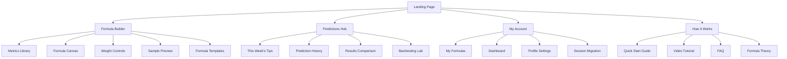
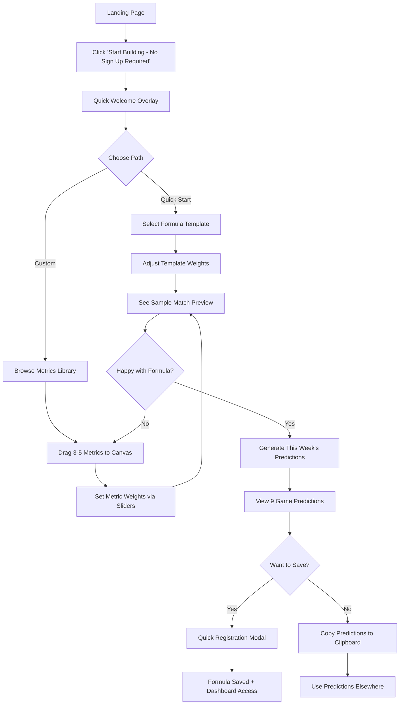
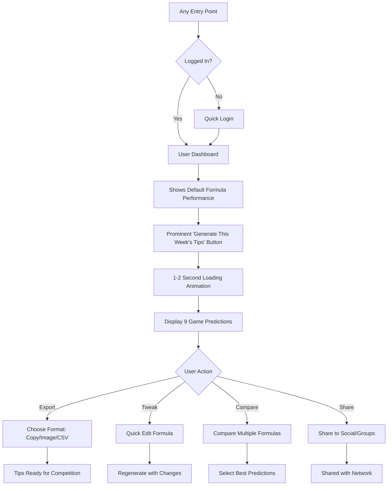
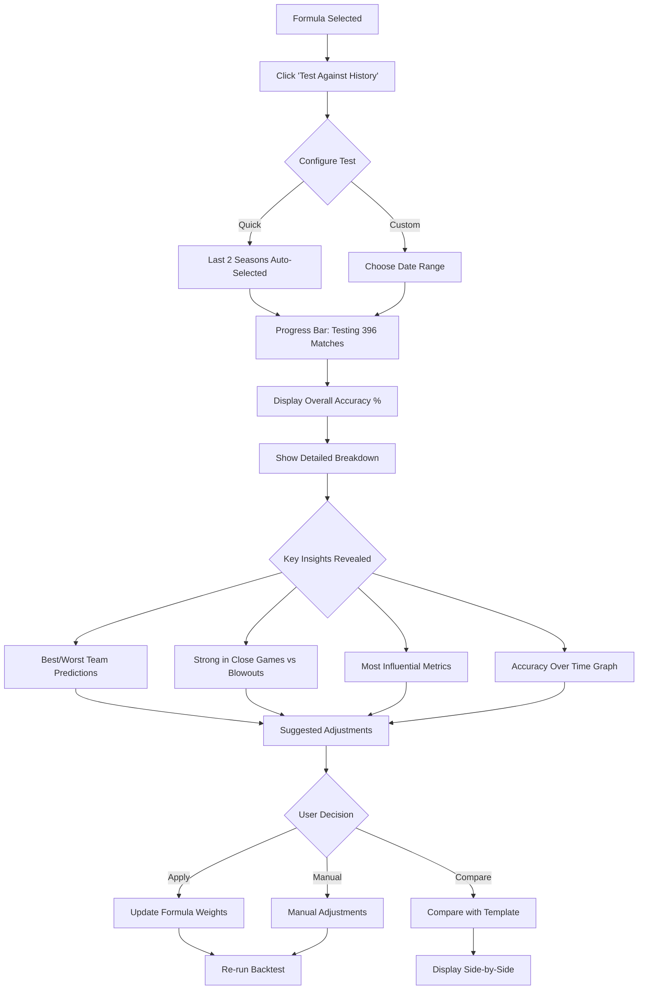

# AFL Prediction Platform UI/UX Specification

## Introduction

This document defines the user experience goals, information architecture, user flows, and visual design specifications for AFL Prediction Platform's user interface. It serves as the foundation for visual design and frontend development, ensuring a cohesive and user-centered experience.

### Overall UX Goals & Principles

#### Target User Personas

**1. The Casual Tipper** 
- Participates in office tipping competitions or with friends
- Wants quick, better-than-random predictions
- Values simplicity over complexity
- Mobile-first user checking tips during commute

**2. The Data Enthusiast**
- Loves testing theories about what wins games
- Wants control over prediction logic
- Enjoys tweaking and optimizing formulas
- Desktop power user seeking accuracy improvements

**3. The Competition Player**
- Serious about tipping competitions
- Needs reliable weekly predictions
- Values both speed and accuracy
- Cross-device user (creates on desktop, checks on mobile)

#### Usability Goals

1. **10-Minute First Success** - New users can create and test their first formula within 10 minutes without registration
2. **3-Click Predictions** - Returning users can generate weekly tips in 3 clicks or less
3. **Zero Training Required** - Drag-and-drop interface intuitive enough that no tutorials needed
4. **Mobile Efficiency** - Core tasks completable one-handed on mobile devices
5. **Progressive Mastery** - Simple start with discoverable advanced features

#### Design Principles

1. **You're the Expert, We're the Tools** - Empower users to express their sports knowledge visually
2. **Show, Don't Tell** - Immediate visual feedback for every action
3. **Game-Day Energy** - Interface should feel exciting like match day, not like spreadsheets
4. **Trust Through Transparency** - Always show how predictions are calculated
5. **Mobile-First, Desktop-Best** - Optimize for mobile use, enhance for desktop power

### Change Log

| Date | Version | Description | Author |
|------|---------|-------------|---------|
| 2025-08-28 | 1.0 | Initial UI/UX specification created | Sally (UX Expert) |

## Information Architecture (IA)

### Site Map / Screen Inventory

### Navigation Structure

**Primary Navigation:** 
- Persistent top navigation bar with 4 main sections: Formula Builder, Predictions, My Account (or Login), Help
- Mobile: Hamburger menu transforming to bottom navigation for logged-in users
- Visual indicator showing current section with AFL team color theming

**Secondary Navigation:**
- Contextual sub-navigation within each main section
- Breadcrumbs on desktop for deep navigation paths
- Mobile: Horizontal scrollable tabs for sub-sections

**Breadcrumb Strategy:** 
- Show on desktop only for paths 2+ levels deep
- Format: Home > Section > Current Page
- Clickable for easy backward navigation

## User Flows

### Flow 1: First-Time Formula Creation

**User Goal:** Create and test my first prediction formula without signing up

**Entry Points:** 
- Landing page "Start Building" CTA
- Direct link from marketing campaigns
- How It Works → "Try It Now"

**Success Criteria:** User generates predictions for upcoming round within 10 minutes

#### Flow Diagram

#### Edge Cases & Error Handling:
- Browser doesn't support drag-and-drop → Provide "Add" buttons as fallback
- User adds too many metrics (>10) → Soft limit with warning, hard stop at 15
- No upcoming round available → Show last round as example with clear messaging
- API data unavailable → Use cached sample data with "Demo Mode" banner
- User refreshes page → Restore formula from sessionStorage

**Notes:** This flow is absolutely critical for conversion. Every friction point loses users, so the template option provides a fast path while custom building remains available.

### Flow 2: Weekly Prediction Generation (Returning User)

**User Goal:** Generate my tips for this week's round quickly

**Entry Points:**
- Email reminder "Round 5 tips are ready"
- Mobile bookmark/PWA icon
- Direct navigation to saved URL

**Success Criteria:** Generate and export predictions in under 3 clicks

#### Flow Diagram

#### Edge Cases & Error Handling:
- Round already started → Show next available round with warning
- Formula has no historical data → Show confidence warning
- Multiple formulas with same accuracy → Highlight default, show comparison
- Network timeout → Progressive loading, show cached if available

**Notes:** The 3-click promise: 1) Land on dashboard, 2) Click generate, 3) Click export. Everything else is optional enhancement.

### Flow 3: Formula Backtesting & Optimization

**User Goal:** Test my formula against historical data to improve accuracy

**Entry Points:**
- Formula Builder → "Test Accuracy" button
- Dashboard → Formula performance card → "Improve"
- Predictions Hub → "Why was this wrong?"

**Success Criteria:** Complete 2-season backtest and see improvement opportunities

#### Flow Diagram

#### Edge Cases & Error Handling:
- Historical data incomplete → Show available range, note limitations
- Backtest takes >5 seconds → Show incremental results as they process
- Formula performs worse than random → Highlight issue, suggest templates
- Same accuracy after changes → Show where predictions actually changed

**Notes:** Backtesting builds trust. Users need to see their formula would have worked historically before trusting it with real predictions.

## Wireframes & Mockups

### Design Files
**Primary Design Files:** To be created in Figma - [Placeholder for design system link]
*Recommendation: Use Figma for collaborative design work with developer handoff features*

### Key Screen Layouts

#### 1. Formula Builder (Desktop)

**Purpose:** Core value proposition screen where users create prediction formulas

**Key Elements:**
- Left sidebar: Metrics Library with search/filter (300px fixed width)
- Center: Formula Canvas with drop zones (fluid width, min 600px)
- Right sidebar: Weight controls and live preview (350px fixed width)
- Top bar: Formula name, save button, test accuracy CTA
- Bottom bar: Confidence score, generate predictions button

**Interaction Notes:** 
- Drag metrics from left to center, drop zones highlight on hover
- Weight sliders update preview in real-time (<100ms response)
- Clicking metric card shows detailed explanation tooltip
- Keyboard shortcuts: Cmd+S to save, Space to preview

**Design File Reference:** Figma → Screens → Formula Builder → Desktop Master

#### 2. Formula Builder (Mobile)

**Purpose:** Maintain full functionality on mobile devices with adapted interactions

**Key Elements:**
- Tab bar at top: Metrics | Formula | Weights (swipeable)
- Metrics tab: Vertical scrolling list with "Add" buttons
- Formula tab: Stacked metric cards with reorder handles
- Weights tab: Full-screen sliders with large touch targets
- Floating action button: Generate predictions (always visible)

**Interaction Notes:**
- Swipe between tabs or tap tab headers
- Long-press to reorder metrics in formula
- Pinch to zoom out and see full formula overview
- Pull down to refresh data

**Design File Reference:** Figma → Screens → Formula Builder → Mobile Master

#### 3. Predictions Dashboard

**Purpose:** Quick access to weekly tips and formula performance

**Key Elements:**
- Hero section: This week's round with prominent generate button
- Formula performance cards: Shows accuracy trend sparkline
- Recent predictions: Last 3 rounds with results overlay
- Quick actions: Generate, Export, Share buttons
- Notification banner: For round reminders and updates

**Interaction Notes:**
- Single tap on formula card to set as default
- Swipe formula cards horizontally to see all formulas
- Pull-to-refresh updates latest results
- Tap prediction to see detailed breakdown

**Design File Reference:** Figma → Screens → Dashboard → Responsive Master

#### 4. Landing Page

**Purpose:** Convert visitors by demonstrating value immediately

**Key Elements:**
- Above fold: Value prop + "Start Building" CTA + live demo preview
- Social proof section: User count, average accuracy, testimonials
- How it works: 3-step visual process
- Formula templates showcase: Preview popular starting points
- Trust builders: Data sources, security, no credit card messaging

**Interaction Notes:**
- Auto-playing (muted) demo of formula building
- Hover on templates shows accuracy statistics
- Sticky CTA appears on scroll past fold
- Progressive disclosure of features as user scrolls

**Design File Reference:** Figma → Screens → Marketing → Landing Page

## Component Library / Design System

### Design System Approach

**Design System Approach:** Custom component library built on top of Tailwind CSS utilities, with AFL-specific theming layer. Components follow atomic design principles (atoms → molecules → organisms) with React component mapping 1:1 with design tokens.

### Core Components

#### 1. Metric Card

**Purpose:** Represent individual metrics that can be added to formulas

**Variants:** 
- Default (in library)
- Selected (in formula)
- Disabled (incompatible/locked)
- Compact (mobile view)

**States:** Default, Hover, Active/Dragging, Focused, Disabled

**Usage Guidelines:** 
- Always show metric name and icon
- Include brief description on hover/tap
- Maintain 16:9 aspect ratio for consistency
- Use team colors for accent when relevant

#### 2. Formula Canvas

**Purpose:** Drop zone and container for building formulas

**Variants:**
- Empty (shows onboarding hints)
- Partially filled (1-4 metrics)
- Full (5+ metrics)
- Validating (during processing)

**States:** Default, Drag-over, Invalid-drop, Processing, Error

**Usage Guidelines:**
- Minimum 3 drop zones visible at all times
- Visual feedback within 50ms of drag events
- Clear affordance for metric reordering
- Progressive disclosure of advanced options

#### 3. Weight Slider

**Purpose:** Adjust importance of metrics in formula (0-100%)

**Variants:**
- Standard (individual metric)
- Grouped (normalize all)
- Locked (template defaults)
- Comparative (A/B testing)

**States:** Default, Hover, Active/Dragging, Focused, Disabled

**Usage Guidelines:**
- Large touch target (44px minimum)
- Show percentage value during adjustment
- Color intensity reflects weight value
- Snap to common values (25, 50, 75, 100)

#### 4. Prediction Card

**Purpose:** Display match predictions with confidence

**Variants:**
- Standard (upcoming match)
- Result overlay (completed match)
- Compact (list view)
- Detailed (with breakdown)

**States:** Default, Hover, Expanded, Correct, Incorrect

**Usage Guidelines:**
- Team logos prominent
- Confidence percentage always visible
- Margin prediction optional
- Tap/click reveals calculation details

#### 5. Action Button

**Purpose:** Primary CTAs throughout the application

**Variants:**
- Primary (Generate, Save)
- Secondary (Export, Share)
- Danger (Delete, Reset)
- Ghost (Cancel, Skip)

**States:** Default, Hover, Active, Loading, Disabled

**Usage Guidelines:**
- Minimum height 44px on mobile, 36px desktop
- Loading state with spinner
- Disabled state clearly distinguished
- Text + icon for important actions

#### 6. Data Viz Components

**Purpose:** Display performance metrics and trends

**Variants:**
- Sparkline (inline trends)
- Accuracy gauge (circular progress)
- Comparison bars (formula vs formula)
- Distribution chart (team performance)

**States:** Loading, Ready, Interactive, Error

**Usage Guidelines:**
- Mobile-friendly (no hover-only interactions)
- Accessible color schemes
- Progressive data loading
- Fallback to tables if charts fail

## Branding & Style Guide

### Visual Identity
**Brand Guidelines:** AFL Prediction Platform brand guidelines to be developed. Interim: Use clean sports aesthetic with optional AFL team color theming.

### Color Palette

| Color Type | Hex Code | Usage |
|------------|----------|-------|
| Primary | #0066CC | Primary actions, links, selected states |
| Secondary | #28A745 | Success states, positive trends, correct predictions |
| Accent | #FFB700 | Warnings, important highlights, confidence indicators |
| Success | #28A745 | Positive feedback, confirmations |
| Warning | #FFB700 | Cautions, important notices |
| Error | #DC3545 | Errors, destructive actions, incorrect predictions |
| Neutral | #6C757D, #F8F9FA | Text, borders, backgrounds |

### Typography

#### Font Families
- **Primary:** Inter (fallback: system-ui, sans-serif) - Clean, readable, works at all sizes
- **Secondary:** Barlow Condensed (fallback: Arial Narrow) - For data-heavy displays
- **Monospace:** JetBrains Mono (fallback: monospace) - For formulas and calculations

#### Type Scale

| Element | Size | Weight | Line Height |
|---------|------|--------|-------------|
| H1 | 32px (mobile: 28px) | 700 | 1.2 |
| H2 | 24px (mobile: 22px) | 600 | 1.3 |
| H3 | 20px (mobile: 18px) | 600 | 1.4 |
| Body | 16px | 400 | 1.5 |
| Small | 14px | 400 | 1.4 |

### Iconography

**Icon Library:** Heroicons (outline style for UI, solid for emphasis)

**Usage Guidelines:**
- 24px default size, 20px for inline, 32px for feature icons
- Always pair with text labels on first use
- Team logos from official AFL API where available
- Metric icons custom designed for clarity

### Spacing & Layout

**Grid System:** 12-column grid with 24px gutters (mobile: 16px)

**Spacing Scale:** 
- Base unit: 4px
- Scale: 4, 8, 12, 16, 24, 32, 48, 64, 96
- Consistent padding: 16px mobile, 24px desktop

## Accessibility Requirements

### Compliance Target
**Standard:** WCAG 2.1 Level AA compliance as minimum, with Level AAA for critical user paths (formula creation and prediction generation)

### Key Requirements

**Visual:**
- Color contrast ratios: 4.5:1 for normal text, 3:1 for large text, 3:1 for UI components
- Focus indicators: Visible outline (2px minimum) with 3:1 contrast ratio against background
- Text sizing: Base 16px, user scalable to 200% without horizontal scrolling

**Interaction:**
- Keyboard navigation: All interactive elements accessible via Tab, drag-drop alternatives provided
- Screen reader support: ARIA labels for all controls, live regions for dynamic updates
- Touch targets: Minimum 44×44px on mobile, 24×24px with sufficient spacing on desktop

**Content:**
- Alternative text: Descriptive alt text for team logos, charts have data tables as fallback
- Heading structure: Logical h1-h6 hierarchy, one h1 per page
- Form labels: Every input explicitly labeled, error messages linked to fields

### Testing Strategy

**Testing Strategy:** 
- Automated testing with axe-core in CI/CD pipeline
- Manual keyboard navigation testing for all user flows
- Screen reader testing with NVDA (Windows) and VoiceOver (iOS/Mac)
- Color blindness simulation for all data visualizations
- Real user testing with assistive technology users before launch

## Responsiveness Strategy

### Breakpoints

| Breakpoint | Min Width | Max Width | Target Devices |
|------------|-----------|-----------|----------------|
| Mobile | 320px | 767px | Phones (iPhone SE to Pro Max) |
| Tablet | 768px | 1023px | iPads, Android tablets |
| Desktop | 1024px | 1439px | Laptops, small monitors |
| Wide | 1440px | - | Large monitors, TV screens |

### Adaptation Patterns

**Layout Changes:**
- Mobile: Single column, stacked components, bottom navigation
- Tablet: Two-column where beneficial, side navigation drawer
- Desktop: Three-column formula builder, persistent sidebars
- Wide: Centered max-width container (1440px) with generous whitespace

**Navigation Changes:**
- Mobile: Hamburger → Bottom tabs (post-login)
- Tablet: Collapsible sidebar with icons + labels
- Desktop: Full sidebar always visible
- Wide: Same as desktop with wider content areas

**Content Priority:**
- Mobile: Core action buttons prominent, secondary features in menus
- Tablet: More features visible, tabbed interfaces for complex areas
- Desktop: Everything visible, hover states for additional info
- Wide: Data-dense views with more metrics shown simultaneously

**Interaction Changes:**
- Mobile: Touch-optimized (swipe, long-press, pull-to-refresh)
- Tablet: Touch + keyboard support, hover states on stylus
- Desktop: Full keyboard shortcuts, right-click menus, drag-drop primary
- Wide: Multi-panel views, side-by-side comparisons

## Animation & Micro-interactions

### Motion Principles

**Motion Principles:**
1. **Purpose Over Polish** - Every animation must aid comprehension or provide feedback
2. **Fast and Subtle** - 200-300ms for most transitions, 400ms maximum for complex animations
3. **Natural Easing** - Use ease-out for entrances, ease-in for exits, ease-in-out for state changes
4. **Respect Preferences** - Honor prefers-reduced-motion settings with instant transitions
5. **Performance First** - Only animate transform and opacity for 60fps on mobile

### Key Animations

- **Metric Card Hover:** Scale 1.02, shadow elevation, 200ms ease-out (Duration: 200ms, Easing: cubic-bezier(0.4, 0, 0.2, 1))
- **Drag & Drop:** Card lifts with shadow, slight rotation on drag start, snap on drop (Duration: 150ms, Easing: ease-out)
- **Weight Slider Change:** Value animates with number ticker effect (Duration: 300ms, Easing: ease-in-out)
- **Loading States:** Skeleton screens with shimmer, pulsing dots for processing (Duration: 1000ms loop, Easing: linear)
- **Success Confirmation:** Green checkmark draws in, brief scale bounce (Duration: 400ms, Easing: spring(1, 100, 10, 0))
- **Tab Switches:** Content slides horizontally on mobile, fade on desktop (Duration: 250ms, Easing: ease-in-out)
- **Error Shake:** Horizontal shake for invalid inputs (Duration: 300ms, Easing: linear)
- **Prediction Reveal:** Stagger fade-in for each match result (Duration: 200ms per item, Easing: ease-out)
- **Confidence Meter:** Animated fill from 0 to percentage (Duration: 600ms, Easing: ease-out)
- **Formula Save:** Brief glow pulse on successful save (Duration: 400ms, Easing: ease-in-out)

## Performance Considerations

### Performance Goals

- **Page Load:** Initial paint < 1.5s, interactive < 3s on 4G mobile
- **Interaction Response:** UI responds within 100ms to user input
- **Animation FPS:** Maintain 60fps for all animations, degrade gracefully

### Design Strategies

**Design Strategies:**

1. **Progressive Enhancement**
   - Core functionality works without JavaScript
   - Enhanced features layer on top progressively
   - Critical CSS inlined, non-critical lazy-loaded

2. **Image Optimization**
   - Team logos as SVG sprites (single HTTP request)
   - WebP with PNG fallback for photos
   - Lazy loading for below-fold images
   - Responsive images with srcset

3. **Code Splitting**
   - Route-based splitting (formula builder, dashboard, etc.)
   - Component lazy loading for heavy features (charts, backtesting)
   - Vendor bundle separation

4. **Caching Strategy**
   - Service worker for offline functionality
   - API responses cached with smart invalidation
   - Static assets with long cache headers

5. **Perceived Performance**
   - Skeleton screens during loading
   - Optimistic UI updates (show success, rollback on error)
   - Progressive data loading (show partial results immediately)

6. **Mobile-Specific Optimizations**
   - Reduced animation complexity on low-end devices
   - Virtualized lists for long scrolling content
   - Debounced/throttled input handlers
   - Intersection Observer for viewport-based loading

## Next Steps

### Immediate Actions

1. **Review with stakeholders** - Present UI/UX spec to product owner and development team for alignment
2. **Create Figma design system** - Build component library and design tokens based on this specification
3. **Design high-fidelity mockups** - Create pixel-perfect designs for key screens (Formula Builder, Dashboard, Landing)
4. **Prototype critical interactions** - Build interactive prototype for drag-and-drop formula creation
5. **Conduct usability testing** - Test prototype with 5-8 target users before development
6. **Prepare developer handoff** - Export assets, document interactions, create style guide
7. **Coordinate with architect** - Align on component structure and state management approach

### Design Handoff Checklist

- [ ] All user flows documented
- [ ] Component inventory complete
- [ ] Accessibility requirements defined
- [ ] Responsive strategy clear
- [ ] Brand guidelines incorporated
- [ ] Performance goals established

## Checklist Results

*UI/UX checklist to be run against this specification once design implementation begins.*

---

**Document Status:** Complete - Ready for stakeholder review and design implementation

**Next Document:** Front-End Architecture Specification (to be created by Design Architect)