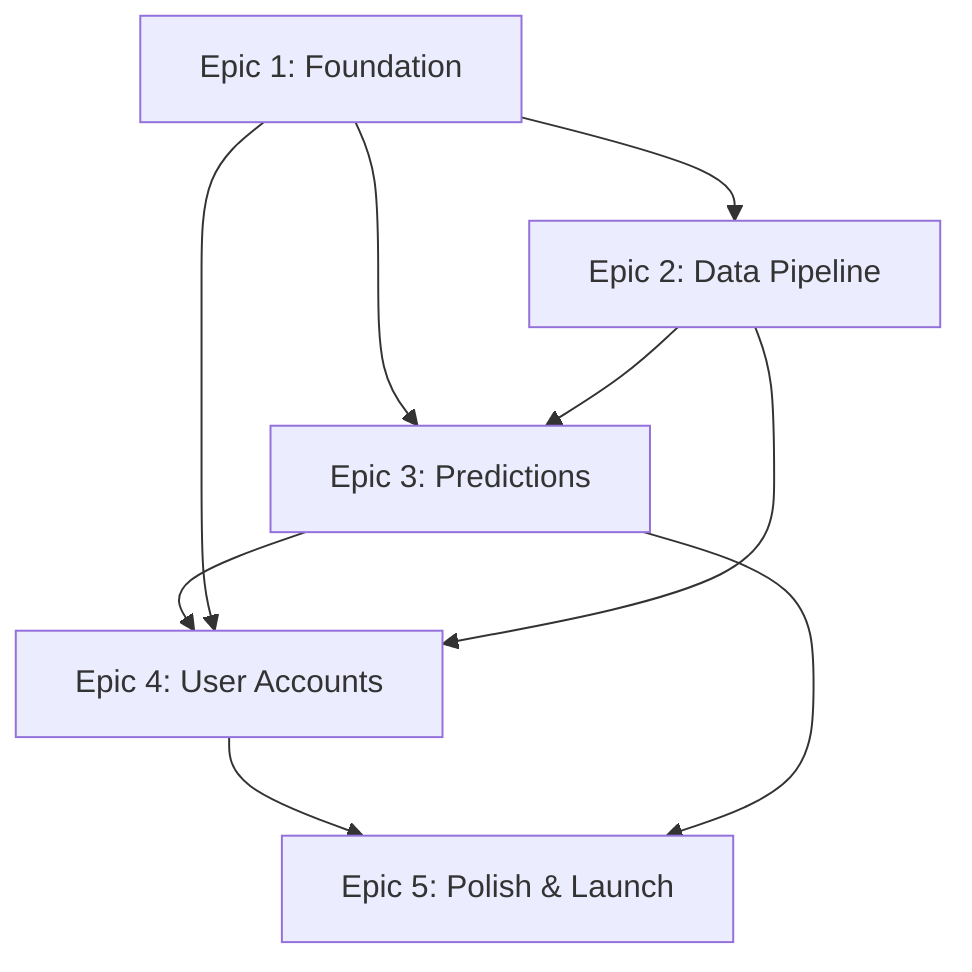

# AFL Data Capture Platform - Epic Overview

## Project Summary
The AFL Data Capture platform democratizes sports prediction through visual formula building. Users can create, test, and refine prediction formulas using drag-and-drop interfaces, with comprehensive backtesting against historical data.

## Epic Roadmap

### Phase 1: Foundation (Weeks 1-2)
**[Epic 1: Foundation & Core Formula Engine](./epic-1-foundation.md)**
- Project setup and CI/CD pipeline
- Core formula builder with drag-and-drop
- Metric library and weight controls
- Formula calculation engine
- **Deliverable:** Working formula builder with sample data

### Phase 2: Data Integration (Weeks 3-4)
**[Epic 2: Data Pipeline & Integration](./epic-2-data-pipeline.md)**
- Squiggle API integration
- AFL Tables scraping
- Data transformation layer
- Real-time predictions
- **Deliverable:** Live AFL data flowing into predictions

### Phase 3: Intelligence (Weeks 5-6)
**[Epic 3: Predictions & Backtesting](./epic-3-predictions-backtesting.md)**
- Historical backtesting engine
- Performance visualization
- Formula comparison tools
- Confidence scoring
- **Deliverable:** Validated predictions with accuracy metrics

### Phase 4: Persistence (Weeks 7-8)
**[Epic 4: User Accounts & Persistence](./epic-4-user-accounts.md)**
- User authentication system
- Formula persistence
- Prediction history
- Multi-device sync
- **Deliverable:** Secure user accounts with saved data

### Phase 5: Production Ready (Weeks 9-10)
**[Epic 5: Polish & Launch Readiness](./epic-5-polish-launch.md)**
- Performance optimization
- Mobile enhancement
- Analytics implementation
- Pre-launch testing
- **Deliverable:** Production-ready platform

## Epic Dependencies

## Critical Path
1. **Epic 1** must complete first (foundation)
2. **Epic 2** can start in parallel with Epic 1 final stories
3. **Epic 3** requires both Epic 1 & 2
4. **Epic 4** can start after Epic 1, parallel with Epic 3
5. **Epic 5** requires all previous epics

## Resource Requirements

### Development Team
- 2 Full-Stack Developers
- 1 DevOps Engineer (part-time)
- 1 UX Designer (first 4 weeks)
- 1 QA Engineer (weeks 5-10)

### Infrastructure
- Azure subscription (<$500/month initially)
- GitHub organization account
- Domain and SSL certificates
- Third-party services (monitoring, analytics)

## Risk Register

| Risk | Impact | Likelihood | Mitigation |
|------|--------|------------|------------|
| API rate limits | High | Medium | Caching, fallback data |
| Performance issues | High | Medium | Progressive optimization |
| Launch day failures | Critical | Low | Gradual rollout, testing |
| Data quality issues | Medium | Medium | Validation, monitoring |
| Security breaches | Critical | Low | Pen testing, security audit |

## Success Metrics

### MVP Launch (Day 60)
- ✅ 1,000 registered users
- ✅ 55%+ average prediction accuracy
- ✅ <3s page load time
- ✅ 99.9% uptime during peak
- ✅ 20% free-to-paid conversion

### Key Performance Indicators
- Formula creation rate: 10+ per hour
- Prediction generation: 100+ per hour
- Backtest completion: 95%+ success
- User retention: D7 >40%, D30 >25%
- NPS Score: >50

## Story Point Breakdown

| Epic | Total Points | Stories | Priority |
|------|-------------|---------|----------|
| Epic 1 | 27 | 7 | P0 |
| Epic 2 | 22 | 6 | P0 |
| Epic 3 | 22 | 7 | P0/P1 |
| Epic 4 | 22 | 7 | P0/P1 |
| Epic 5 | 24 | 8 | P0/P1 |
| **Total** | **117** | **35** | - |

## Velocity Planning
- Assumed velocity: 15 points/sprint (2 developers)
- Total sprints: 8 (4 two-week sprints)
- Buffer: 20% for unknowns
- Total duration: 10 weeks

## Definition of Ready (DoR)
- [ ] User story has clear acceptance criteria
- [ ] Dependencies identified and available
- [ ] Technical approach agreed upon
- [ ] Estimated in story points
- [ ] Test criteria defined
- [ ] Design mockups available (if UI)

## Definition of Done (DoD)
- [ ] Code complete and reviewed
- [ ] Unit tests written and passing
- [ ] Integration tests passing
- [ ] Documentation updated
- [ ] Deployed to staging
- [ ] Acceptance criteria verified
- [ ] Product owner approved

## Communication Plan
- Daily standups: 9:30 AM
- Sprint planning: Mondays (2 hours)
- Sprint review: Every 2nd Friday
- Retrospectives: After each sprint
- Stakeholder updates: Weekly email

## Launch Checklist
- [ ] All epics complete
- [ ] Security audit passed
- [ ] Performance targets met
- [ ] Documentation complete
- [ ] Support systems ready
- [ ] Marketing materials prepared
- [ ] Team trained on procedures
- [ ] Rollback plan tested
- [ ] Monitoring configured
- [ ] Legal requirements met

## Next Steps
1. Review and approve epic breakdown
2. Set up development environment (Epic 1, Story 1.1)
3. Recruit beta testers
4. Finalize infrastructure setup
5. Begin Sprint 1 planning

---

**Document Status:** Complete - Ready for team review and sprint planning
**Last Updated:** 2025-08-28
**Owner:** Product Owner (Sarah)